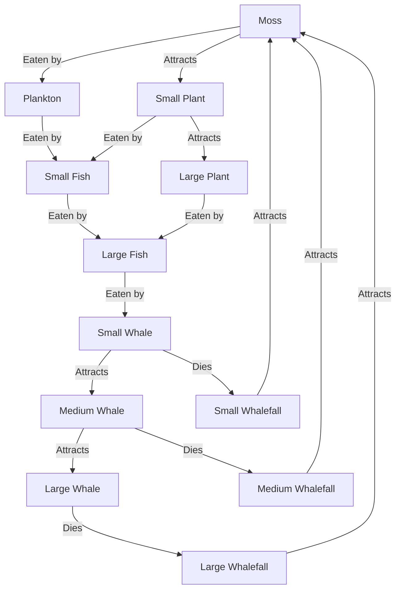

# Whalefall Idle

```mermaid
flowchart TB
p1[Moss]
p2[Small Plant]
p3[Large Plant]
c1[Plankton]
c2[Small Fish]
c3[Large Fish]
w1[Small Whale]
w2[Medium Whale]
w3[Large Whale]
f1[Small Whalefall]
f2[Medium Whalefall]
f3[Large Whalefall]
f1 & f2 & f3
-- Attracts --> p1
-- Attracts --> p2
-- Attracts --> p3
p1 -- Eaten by --> c1
c1 & p2 -- Eaten by --> c2
c2 & p3 -- Eaten by --> c3
c3
-- Eaten by --> w1
-- Attracts --> w2
-- Attracts --> w3
w1 -- Dies --> f1
w2 -- Dies --> f2
w3 -- Dies --> f3
```